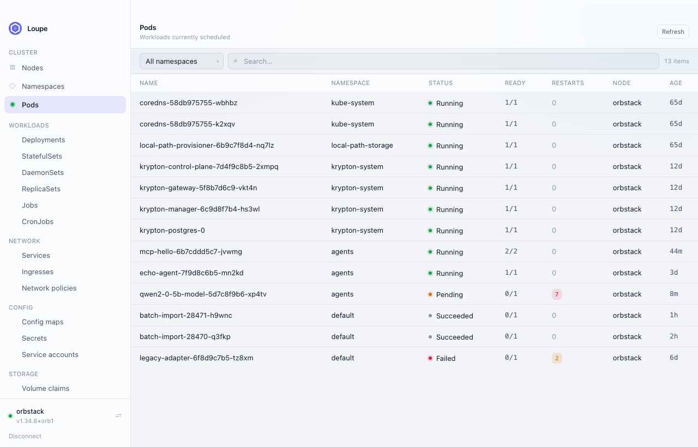
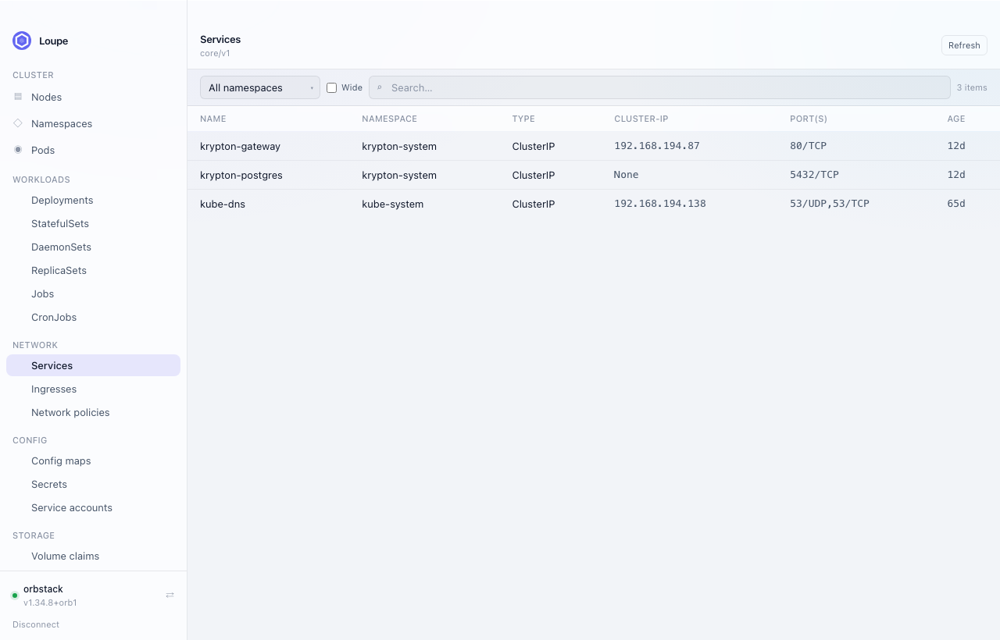
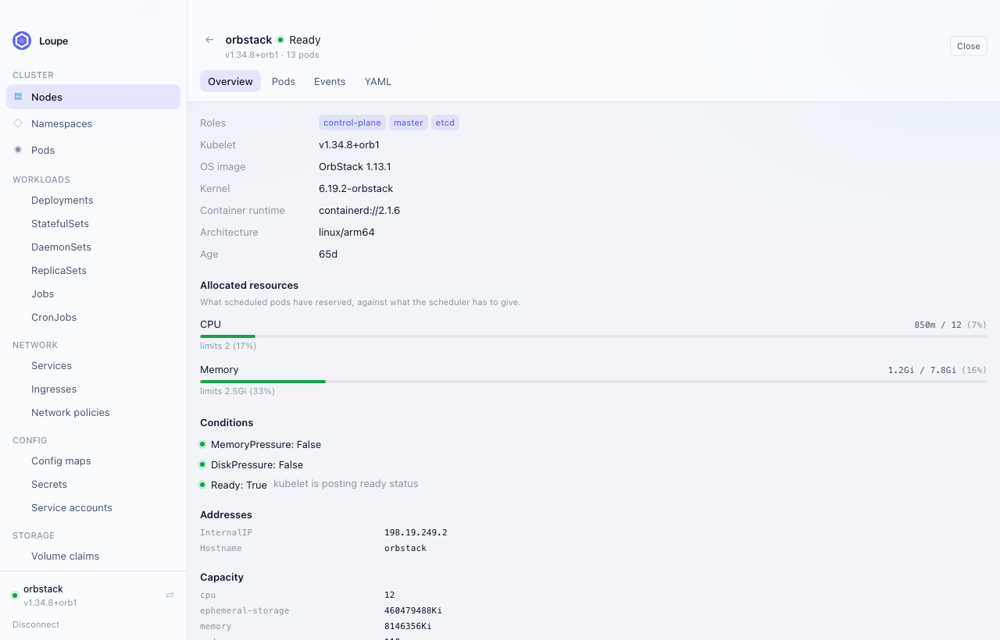
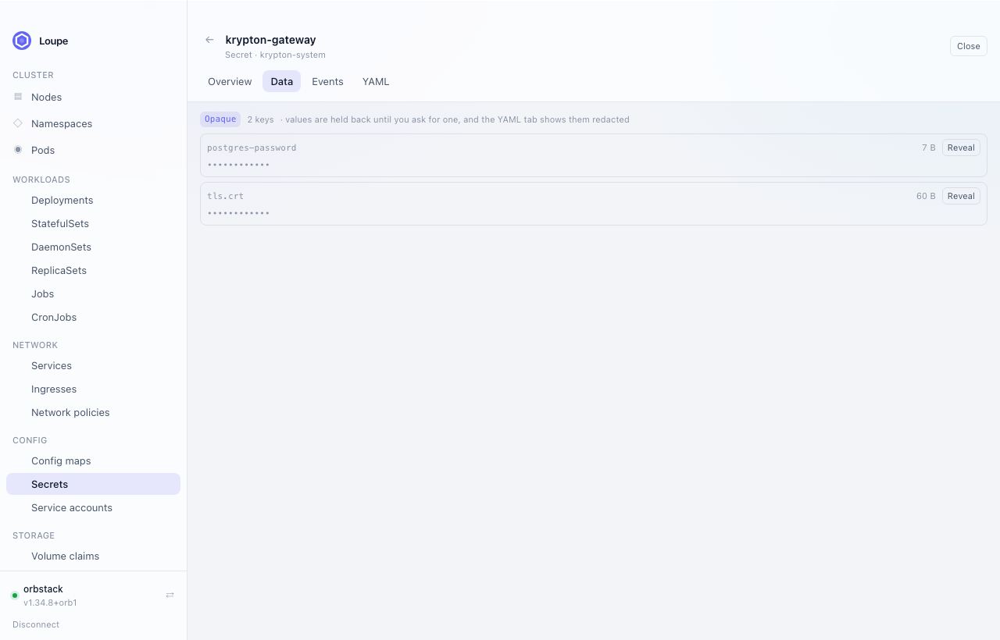
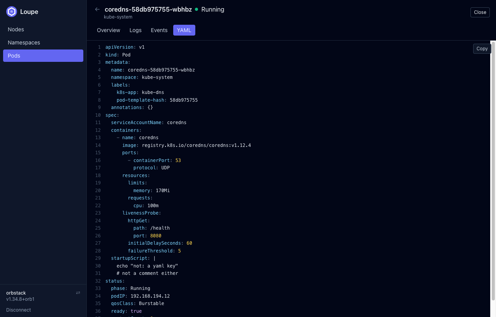

<p align="center">
  
</p>

<h1 align="center">Loupe</h1>

<p align="center">
  An open-source desktop client for Kubernetes. Free, and staying that way.
</p>

<p align="center">
  <a href="https://github.com/kryptonhq/loupe/actions/workflows/ci.yml"></a>
  <a href="https://codecov.io/gh/kryptonhq/loupe"></a>
  <a href="LICENSE"></a>
</p>

<p align="center">
  
</p>

<p align="center">
  <em>Screenshots use demo data, not a live cluster.</em>
</p>

---

## Why

Lens moved behind a commercial licence and OpenLens was discontinued. The
official Kubernetes Dashboard was archived in January 2026 for want of
maintainers. Loupe is an Apache-2.0 alternative that reads the same
kubeconfig as `kubectl` and behaves the way an operator expects.

Loupe is a companion to
[kryptonhq/runtime](https://github.com/kryptonhq/runtime), the in-cluster
AI agent runtime — but it is a general Kubernetes client and does not
require Krypton Runtime to be installed.

## What works today

- Kubeconfig context discovery, connecting, and switching cluster
- Views for nodes, namespaces and pods, with search and paging
- Pod detail: containers and their termination reasons, conditions,
  labels, events, and the manifest
- Node detail: allocated CPU and memory against what the scheduler has
  left, taints, pressure conditions, and the pods scheduled there
- Namespace detail: pod health at a glance, ResourceQuota headroom,
  finalizers when a namespace will not go away, and everything
  happening inside it
- Workloads, networking, config and storage — deployments, statefulsets,
  daemonsets, jobs, cronjobs, services, ingresses, config maps, secrets,
  volume claims and the rest — listed with the same columns `kubectl get`
  prints, because the API server does the printing
- Any custom resource, discovered from the cluster's own API — a CRD
  installed a minute ago is browsable without a new build, and shows
  whatever printer columns its author defined
- Secrets are described without being disclosed: keys and sizes are
  shown, values arrive one at a time on request, and the YAML tab
  redacts them
- Helm releases read straight from the release secrets: values, rendered
  manifest, notes and revision history, with no `helm` binary needed
- Editing: the YAML tab writes back as a full replace, so an object
  someone else changed underneath you is rejected rather than silently
  overwritten. Deleting is deliberately not implemented yet
- Light, dark, or follow-the-system appearance, remembered in
  `settings.json` beside the app's other config
- Pod logs, streamed live — with container selection, timestamps, and
  `previous` for reading why a crashed container died

<p align="center">
  
</p>

<p align="center">
  <em>Listings use the API server's own printer, so the columns match
  <code>kubectl get</code> — for built-in kinds and custom resources alike.</em>
</p>

<p align="center">
  
</p>

<p align="center">
  
</p>

<p align="center">
  <em>A Secret is described without being disclosed.</em>
</p>

<p align="center">
  
</p>

## Security model

The Rust process owns every cluster interaction. The webview never
receives a kubeconfig, a bearer token, or an API server URL it could
exfiltrate — it calls typed commands and gets back summarised data. That
matters because the frontend is a bundled browser engine, and keeping
credentials out of it removes a whole class of risk.

Loupe holds **no credentials of its own**. It authenticates as whoever
your kubeconfig says you are, so the API server decides what you can see.
If a listing comes back denied, that is your RBAC — not a bug in the app,
and the error is surfaced rather than swallowed into an empty table.

## Installing

```bash
brew install --cask kryptonhq/tap/loupe
```

Loupe is not notarised by Apple yet, so macOS blocks the first launch.
Allow it once under **System Settings → Privacy & Security → Open
Anyway**, or install with `--no-quarantine`.

Or take a build from [releases](https://github.com/kryptonhq/loupe/releases):

| Platform | Download |
| --- | --- |
| macOS (Apple Silicon) | `Loupe_<version>_aarch64.dmg` |
| macOS (Intel) | `Loupe_<version>_x64.dmg` |
| Linux | `.AppImage` (portable) or `.deb` |
| Windows | `-setup.exe` or `.msi` |

Loupe reads the same kubeconfig as `kubectl`, so there is nothing to
configure — it lists the contexts you already have.

## Building from source

Prerequisites: [Rust](https://rustup.rs), Node 22+, pnpm 10+. On macOS
you also need the Xcode command line tools.

```bash
pnpm install
pnpm tauri dev
```

To produce a distributable bundle:

```bash
pnpm tauri build
```

## Development

```bash
pnpm test                      # frontend unit tests
pnpm test:coverage             # …with a coverage report
cargo test --manifest-path src-tauri/Cargo.toml
```

CI runs `cargo fmt --check` and `cargo clippy -- -D warnings` as well, so
it is worth running both before pushing:

```bash
cargo fmt --manifest-path src-tauri/Cargo.toml
cargo clippy --manifest-path src-tauri/Cargo.toml --all-targets -- -D warnings
```

The Rust suite includes tests that need a real cluster. They are ignored
by default; point them at a local one to run them:

```bash
LOUPE_TEST_CONTEXT=orbstack \
  cargo test --manifest-path src-tauri/Cargo.toml -- --ignored
```

`pnpm dev` on its own serves the UI in a plain browser, where there is no
Tauri bridge. In that case Loupe falls back to the demo fixtures in
`src/dev/fixtures.ts`, so layout work does not need a cluster. That path
is dev-only and is stripped from production builds.

## Layout

```
src/                     React + TypeScript frontend
  components/            Shared UI (Table, Chip, LogViewer, YamlView)
  lib/api.ts             Typed wrappers over the Tauri commands
  lib/highlight.ts       YAML tokenizer for the manifest view
  pages/                 Context picker, resource lists, detail views
src-tauri/
  src/lib.rs             Tauri command surface
  src/cluster/           kubeconfig, session, resources, detail, logs,
                         discovery, server-side printing, helm, edit
  src/error.rs           Error type shared across the IPC boundary
```

The frontend mirrors the runtime's operator UI — same Tailwind theme,
same mark — so the two read as one product.

## Releasing

Tag-driven, built by GitHub Actions, published as a GitHub release. See
[RELEASING.md](RELEASING.md).

## Contributing

Contributions are welcome. Loupe uses the
[DCO](https://developercertificate.org/) rather than a CLA — sign your
commits with `git commit -s` and you keep your copyright. See
[CONTRIBUTING.md](CONTRIBUTING.md) for the details,
[GOVERNANCE.md](GOVERNANCE.md) for how decisions get made, and
[SECURITY.md](SECURITY.md) before reporting anything security related.

This project follows the
[CNCF Code of Conduct](https://github.com/cncf/foundation/blob/main/code-of-conduct.md).

## Status

The read path covers the everyday objects; editing exists, deleting does
not. Next:

- Detail views that follow ownership — the pods behind a deployment, the
  endpoints behind a service, the volume behind a claim
- Multi-cluster (several connected contexts at once)
- Deleting, behind a confirmation that names what goes
- `exec` into a container

## Licence

Apache 2.0. See [LICENSE](LICENSE).
